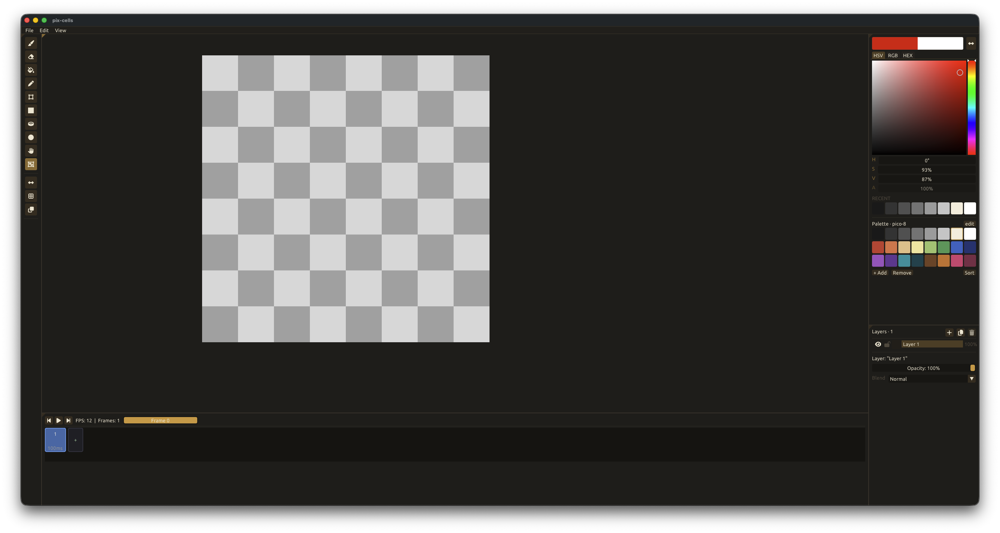

# pix-cells

A pixel art editor built in C++20 with Dear ImGui.



## Features

### Drawing Tools
| Key | Tool |
|-----|------|
| `B` | Brush — freehand painting with adjustable size and round/square tip |
| `E` | Eraser — erase to transparent |
| `F` | Fill — flood-fill at cursor |
| `L` | Line |
| `R` | Rectangle / Filled Rectangle |
| `U` | Circle / Filled Circle |
| `M` | Move — pan the canvas |
| `S` | Rect Select — drag to select; lift, move, and scale the selection |
| `[` / `]` | Decrease / Increase brush size |

### Layers
- Add, delete, rename, toggle visibility, and lock layers per frame
- Per-layer **opacity** (0–100%) and **blend modes**: Normal, Multiply, Screen, Overlay, Add
- Drag-and-drop to reorder layers
- Locked layers block all pixel-write operations (brush, fill, paste, delete)

### Selection
- Rectangular selection with marching-ants overlay
- Lift selection to a floating buffer — move and nearest-neighbour scale via 8 resize handles
- `Ctrl+A` select all · `Ctrl+C/X` copy/cut · `Ctrl+V` paste · `Delete` erase · `Esc` cancel

### Animation
- Multi-frame timeline with per-frame duration
- Play/pause transport with configurable FPS
- Drag-and-drop to reorder frames; animation tag ranges auto-adjust
- Sprite-sheet export (grid layout, configurable columns)

### Palette
- HSV / RGB / HEX color picker
- 8-column swatch grid with add, remove, and sort
- Recent colors row (last 8 used)
- Ships with a built-in PICO-8 palette
- **Import / Export** palettes via the "edit" button in the Color panel:
  - **HEX** (`.hex` / `.txt`) — one `#RRGGBB` per line; compatible with Lospec exports
  - **GPL** (`.gpl`) — GIMP Palette format; compatible with GIMP, Aseprite, and Lospec exports

### File I/O
- **`.pixc`** — native binary format preserving all frames, layers, opacity, blend modes, and palette
- **PNG** import/export — single-frame flat composite
- **Sprite sheet** export — all frames composited into a single PNG

### View
- Zoom to cursor (scroll wheel)
- Symmetry toggle and pixel grid overlay
- **Onion skin** — ghost the previous frame (red tint) and/or next frame (blue tint) under the active canvas; mode selector in the Tools panel to show both, previous only, or next only
- **UI scaling** — adjust interface size from 75% to 200% via Edit > Preferences; setting persists across sessions
- **Multi-document tabs** — open and switch between multiple projects in the same window; "+" button creates new blank document, tab X or Ctrl+W closes the active document (prompts to save if unsaved)
- Dockable panels — layout persists across sessions
- **Floating Preview panel** — mini-preview window with independent zoom (scroll to adjust 1–32×) and pan controls

### Undo / Redo
- `Ctrl+Z` / `Ctrl+Y` — full undo/redo stack per session

---

## Build

**Requirements**: CMake 3.20+, a C++20 compiler, OpenGL 3.3.

Dependencies (SDL3, Dear ImGui docking branch, stb, lunasvg) are fetched automatically by CMake.

```bash
cmake -B build
cmake --build build
./build/pix-cells
```

Run tests:
```bash
ctest --test-dir build --output-on-failure
```

---

## Architecture

```
pix-cells/
├── src/
│   ├── app_state.h/cpp      — All runtime state: AppState, CanvasState, ToolsState,
│   │                          PaletteState, SelectionState, Layer, Frame; tool:: constants
│   ├── canvas.h             — Canvas struct (pixels, width, height, get/set/fill)
│   ├── canvas_state.cpp     — Composite, frame/layer ops, undo/redo stack
│   ├── blend.h              — blend_pixel(): Porter-Duff "over" + blend modes (shared)
│   ├── raster.h/cpp         — raster:: pure pixel algorithms (brush, line, fill,
│   │                          rect, ellipse, nn-scale) on Canvas&; in pix-cells-core
│   ├── icon_manager.h/cpp   — Loads/caches SVG icons (lunasvg) as GL textures
│   ├── cursor_manager.h/cpp — Per-tool SDL cursors from SVGs
│   ├── ui_scale.h/cpp       — UI scaling (5 levels: 75%, 100%, 125%, 150%, 200%); persists to settings.ini
│   ├── main.cpp             — SDL3+ImGui init, main loop, keyboard shortcuts
│   ├── workbench.h/cpp      — Fullscreen dockspace, default layout (DockBuilder)
│   ├── log.h/cpp            — Log() writes to file + 500-entry ring buffer
│   ├── png_io.h/cpp         — PNG save/load/sprite-sheet via stb_image
│   ├── pixc_io.h/cpp        — .pixc binary format save/load
│   ├── palette_io.h/cpp     — Palette import/export (.hex and .gpl)
│   └── panels/
│       ├── canvas_panel        — GL texture, zoom/pan, tool input, selection overlay
│       ├── tools_panel         — Tool buttons (SVG icons via icon_manager), view toggles
│       ├── tool_settings_panel — Tool-specific settings (brush size, shape, onion skin mode)
│       ├── palette_panel       — Color picker, swatch grid, recent colors
│       ├── layers_panel        — Layer list, opacity, blend mode, lock/visibility
│       ├── timeline_panel      — Frame strip, transport controls, playback, tags
│       ├── menu_bar            — File/Edit/View menus, async file dialogs
│       └── log_panel           — Log viewer with auto-scroll
├── tests/                   — Unit tests (blend, composite, frames, history, raster,
│                              pixc, palette_io), one ctest target per area
├── icons/                   — SVG icon set rasterized at runtime via lunasvg
└── fonts/
    └── Ubuntu-Regular.ttf   — UI font (15px)
```

### Data model

All state lives in `AppState`. `CanvasState` owns a `vector<Frame>`, each with a `vector<Layer>`. The active layer's `Canvas` holds a flat `uint32_t` RGBA8 pixel buffer (R in bits 0–7). After any pixel write, `rebuild_composite()` re-blends all visible layers into the `composite` buffer and sets `dirty = true`, triggering a `glTexSubImage2D` upload on the next frame.

### PIXC format

Binary, little-endian (`fread`/`fwrite` native byte order). Extension `.pixc`.

```
HEADER  (16 bytes)
  [0-3]   char[4]   magic         'P' 'I' 'X' 'C'
  [4-5]   uint16    version       currently 2 (v1 = no TAGS block)
  [6-7]   uint16    width         canvas width in pixels
  [8-9]   uint16    height        canvas height in pixels
  [10-11] uint16    frame_count
  [12-15] float32   fps

PALETTE
  uint16    color_count
  per color (×color_count):
    float32   r
    float32   g
    float32   b
    float32   a           (all channels 0–1)
  uint8     name_len
  char[name_len]  palette_name

FRAMES  (×frame_count)
  uint16    duration_ms
  uint16    layer_count
  per layer (×layer_count):
    uint8     name_len
    char[name_len]  layer_name
    uint8     visible     1=true, 0=false
    uint8     locked      1=true, 0=false
    float32   opacity     0–1
    uint8     blend_mode  0=Normal 1=Multiply 2=Screen 3=Overlay 4=Add
    uint32[width × height]  pixels   RGBA8, R in bits 0–7, row-major

TAGS  (version 2+ only)
  uint16    tag_count
  per tag (×tag_count):
    uint8     name_len
    char[name_len]  tag_name
    uint16    start       inclusive frame index
    uint16    end         inclusive frame index
  int16     active_tag    -1 = all frames
```

Notes:
- Strings use a 1-byte length prefix, then raw bytes (max 255 chars).
- `ToolsState` and palette UI state (`selected_swatch`, `recent_colors`) are not persisted.
- On load, `active_frame` and `active_layer` reset to 0; tag ranges are clamped to the frame count. Version 1 files load cleanly with no tags.

---

## Stack

| Component | Library |
|-----------|---------|
| Window / Input | SDL3 (static) |
| UI | Dear ImGui — docking branch (v1.92+) |
| Renderer | OpenGL 3.3 core |
| Image I/O | stb\_image / stb\_image\_write |
| Icons | SVG rasterized at runtime via lunasvg |
| Build | CMake 3.20+, FetchContent |
